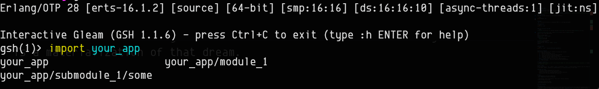
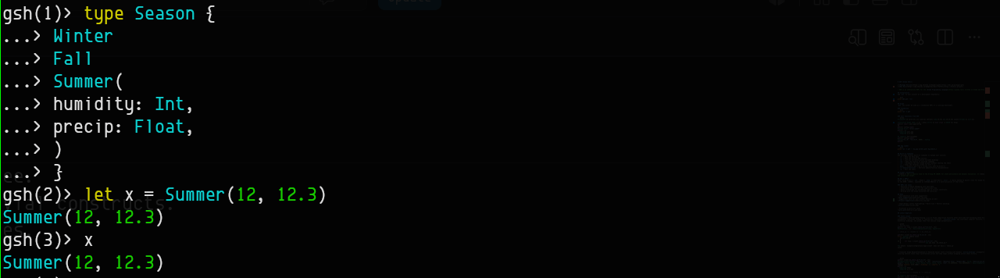
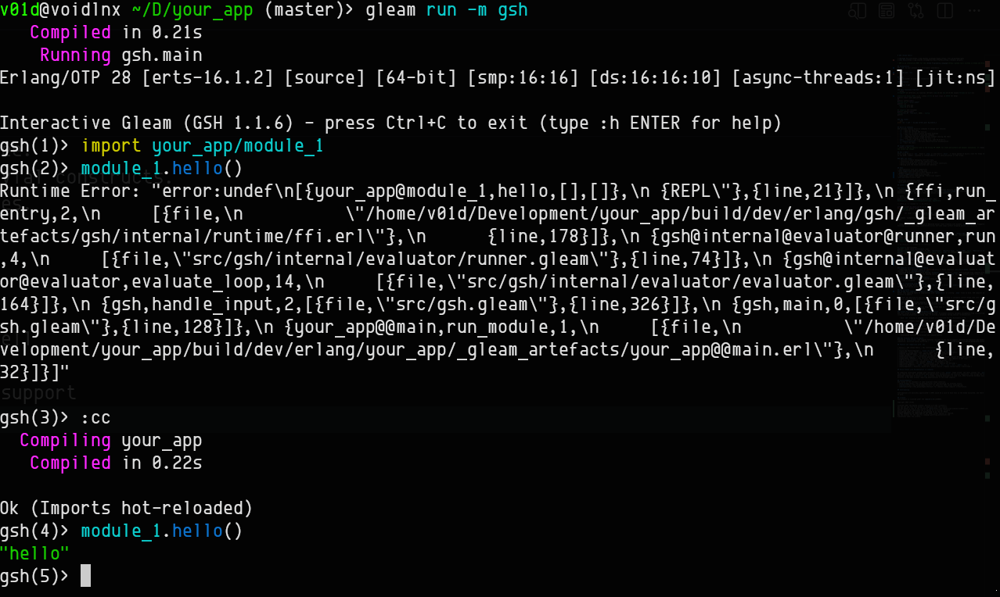

# GSH (Gleam Shell)

[](https://hex.pm/packages/gsh)
[](https://hexdocs.pm/gsh/)
[](https://v4rm4n.github.io/gsh/)

> GSH is an interactive REPL for the [Gleam Programming Language](https://gleam.run/) written in Gleam and Erlang.

📖 **New to GSH?** The **[GSH Usage Guide](https://v4rm4n.github.io/gsh/)** is a friendly walkthrough of a few things GSH can do.

## Installation
Add `gsh` to your project as a development dependency:

```bash
gleam add gsh --dev
```

## Usage
`gsh` can either be used as a standalone REPL or a live-app bootloader.

### Standalone
```bash
gleam run -m gsh
```

### Call functions from GSH
```gleam
Erlang/OTP 28 [erts-16.1.2] [source] [64-bit] [smp:16:16] [ds:16:16:10] [async-threads:1] [jit:ns]

Interactive Gleam (GSH 1.3.0) - press Ctrl+C to exit (type :h ENTER for help)
gsh(1)> import your_app/config
gsh(2)> config.load()
Execution Error: "error:undef\n[{your_app@config,load,[],[]},
  ...
gsh(3)> :cc
  Compiling your_app
   Compiled in 0.37s

Ok
gsh(4)> config.load()
Config("0.1.0", "0.0.0.0", 8000) : Config
gsh(5)> 
```

### App loader
```bash
gleam run -m gsh -- my_app worker_pool bg_module_1
```

### Prying (REPL-driven debugging)
Pause a live process at a point in your code, attach the shell to it, evaluate code **inside** that process, then let it carry on:

```gleam
// src/hello.gleam
@external(erlang, "gsh_pry", "pry")
fn pry(value: a, label: String) -> a

pub fn greet(name: String) -> Nil {
  let name = pry(name, "name")
  io.println("Hello, " <> name <> "!")
}
```

```gleam
gsh(4)> hello.start()
Nil

[pry] #1 <0.115.0> paused at "name" (src/hello.gleam). Type :pry to attach.
gsh(5)> :pry
Attached to #1 <0.115.0> at "name" (src/hello.gleam)
name = "ada"
pry(name)> name <> " lovelace"
"ada lovelace" : String
pry(name)> :continue
Resumed <0.115.0>
Hello, ada!
```

`pry` calls are for development: they only pause while a GSH session runs in the same VM, and a production build doesn't include GSH. The **[Prying chapter](https://v4rm4n.github.io/gsh/)** of the guide covers the whole flow.

## Built-in Commands
GSH includes several built-in commands to manage your session:
- `:h` - Show the help menu
- `:v` - Show the current GSH version
- `:b` - List all currently active variable bindings
- `:hs` - Show the history of executed commands
- `:cc` - Recompile the host Gleam project without leaving the shell
- `:c` - Clear the terminal screen (or Ctrl + L)
- `:d` - Toggle debug output (evaluation latency)
- `:logs` - Show logs captured from background apps
- `pid()` - Create a pid from a string (e.g. pid("<0.34.0>"))
- `:h <module/function>` - Retrieve module/function documentation
- `:pry` / `:pry list` / `:pry <id>` - Attach to a process paused at a pry point
- `:continue` - Resume the attached process
- `:pry on` / `:pry off` - Enable or disable pry points
- `:q` - Exit the shell

## Target limitations
> **Note:** GSH is heavily tied to the Erlang VM (BEAM) for state persistence and dynamic evaluation. It **does not** support the JavaScript target.

## Why a REPL?
After using Elixir's `iex`, OCaml's `utop` or even Rust's `evcxr`. I really wanted to build a tool for Gleam that gets me closer to the BEAM. **GSH**, expanded as **Gleam SHell** is a materialization of that dream.

### REPL use cases
  - Function & module debugging with mock data.
  - Interaction with actors & the supervision tree.
  - Quick scratch-pad for validating logic & trivial constructs.
  - Working with the Gleam ecosystem and libraries.
  - Pausing live processes to inspect them with `:pry`.

## Demo
- Tab-completion with auto suggestions

- Suggestions work for your project modules as well

- Input/Output syntax highlighting + Multi-line support

- Compile your project before calling functions. Recompile after edits!


- Processes & built-ins (pid)


## Feature highlights

1. **Tab-autocompletion & suggestions:**
    Press \<TAB> during imports or function calls to get completion & suggestions.

2. **Stateless session history:**

    Use the \<up and down arrows> to navigate through previously entered commands. History isn't saved after the session ends.

3. **Word-wise navigation:**
    
    Ctrl+\<left or right arrows> allow word-wise navigation.

4. **Dynamic function redefinition:**

    Swap out function logic on the fly without restarting the shell. While the Gleam compiler strictly forbids duplicate function names within a module, GSH acts as a dynamic REPL layer—automatically pruning your historical state to allow Elixir-style rapid prototyping.

5. **Observer GUI support:**
    
    Provided you have Erlang with wxwidgets support, `:obs` will open the Observer GUI.

6. **Automated configuration (`gleam.toml`):**
    
    Pre-load your favorite stdlib or project modules and declare background applications to launch automatically on startup. Eliminate repetitive CLI flags and setup typing by adding a [tools.gsh] table directly to your project's gleam.toml. Modules like gleam/string or gleam/list will be ready on line 1, and your OTP services will boot instantly in the background.

    ```
    # gleam.toml
    name = "your_app"
    version = "1.0.0"

    [dependencies]
    gleam_stdlib = "~> 0.34"

    [tools.gsh]
    imports = [
      "gleam/string",
      "gleam/int",
      "gleam/bool",
      "gleam/set",
      "gleam/list",
      "gleam/result",
      "gleam/option",
      "gleam/erlang/process"
    ]
    apps = [
      "your_app"
    ]
    ```
    
7. **Multi-line pasting:**

    Paste massive blocks of code, complex types, or deeply nested functions without breaking a sweat. Under the hood, GSH leverages Bracketed Paste Mode and dynamic chunk reassembly to safely swallow huge clipboard dumps without triggering premature evaluation, character truncation, or terminal flooding.

8. **Safe abort escape hatch (Ctrl+X):**

    Made a typo or got stuck inside a multi-line continuation prompt (`...>`) missing a closing brace? Press `Ctrl+X` to instantly abort the current input buffer and drop back to a fresh, clean prompt — without crashing the REPL or waking up the Erlang VM's low-level break menu.

9. **Context-aware multiline syntax highlighting:**

    GSH doesn't just colorize single lines; it tracks your AST state across continuations. Multiline strings, escaped quotes (\"), and deeply nested closures are intelligently parsed and highlighted on the fly, ensuring your code remains beautiful and readable even during massive clipboard dumps.

10. **Prying:**

    Drop a `pry` call into your code and GSH pauses the process that reaches it. Attach with `:pry`, run code inside the paused process, and resume it with `:continue`. See the [guide](https://v4rm4n.github.io/gsh/) for the full walkthrough.

## How it works
### In-RAM Fast Compilation Pipeline (Sub-50ms Latency)
Rather than spawning heavy OS subprocesses with `gleam build` or writing `.beam` files to disk, GSH compiles and executes code directly in memory:

  - **Fast AST Emission:** Executes gleam compile-package --no-beam to instantly convert Gleam code into raw Erlang (.erl) source, bypassing disk artifact writes.

  - **Native In-VM Bytecode Loading:** Uses an Erlang FFI bridge (compile:file with [binary] + code:load_binary) to compile .erl files directly into RAM and hot-load the bytecode into the running VM.

  - **Result:** Evaluation latency drops from ~375ms down to ~18ms (~20x speedup), delivering real-time interactive feedback below human perception thresholds.

### Single Persistent Node & Side-Effect Memoization
GSH runs inside a single, long-lived Erlang VM node. To prevent historic variable assignments from re-executing side effects (like spawning processes, printing logs, or hitting a database) during session re-evaluations:

  - Each `let` binding is automatically wrapped in a type-safe Process Dictionary cache.

  - Subsequent prompts reuse the cached memory pointer, ensuring side-effecting code executes exactly once.

### Stateful Lexical Scope Tracking
Session scope is tracked in an explicit ShellState record across evaluations. GSH dynamically merges, prunes, and re-injects:

  - Active variable bindings and shadowed variables

  - Global module imports and custom type definitions

  - Interactive function declarations and command history

### Raw Terminal TUI & I/O Engine
Powered by `etch_erlang`, GSH toggles terminal raw mode on the fly to support character-by-character key handling, live TAB completion, multiline syntax buffering (`...>`), and ANSI color formatting without corrupting background process stdout.

## Feature set comparison with `iex`

| Feature | GSH (Gleam Shell) | IEx (Interactive Elixir) |
|---|---|---|
| **Live App Bootstrapping** | `gleam run -m gsh -- app` | `iex -S mix` |
| **Syntax** | Gleam (Rust-like, strict types) | Elixir (Ruby-like, dynamic) |
| **Syntax Highlighting** | Yes (ANSI-based) | Yes (Configurable ANSI) |
| **Type System** | Static (recompiles on the fly) | Dynamic |
| **Evaluation Engine** | File-backed generation + Hot code reload | Direct Erlang AST evaluation |
| **Side-Effect Safety** | Yes (Process Dictionary memoization) | Yes (Native to AST loop) |
| **VM State Persistence** | Yes (Actors, PIDs, ETS stay alive) | Yes |
| **Fault Tolerance** | Yes (Catches `Badarg` / VM crashes) | Yes |
| **Multiline Input** | Yes (Buffer completion) | Yes (Native AST parsing) |
| **Built-in Helpers** | `pid()` (easily extensible) | `h()`, `i()`, `v()`, `pid()`, etc. |
| **Autocomplete** | Keywords, bound vars, module exports | Deeply context-aware + docstrings |
| **Live Process Debugging** | `pry` calls + `:pry` | `IEx.pry` + `IEx.break!` |

## Elixir-Style Live Documentation (h command)

By combining intelligent package path resolution with a live `glexer` token stream, the shell locates raw `.gleam` source files, lexes them on the fly, and extracts both module-level documentation and function signatures. This brings the legendary, tactile developer experience of Elixir's `iex` to Gleam, allowing developers to read rich, ANSI-formatted markdown documentation directly in the REPL without requiring modifications to the Gleam compiler.

## Acknowledgments
GSH stands on the shoulders of some excellent Gleam libraries:
- [etch_erlang](https://hex.pm/packages/etch) for non-blocking raw terminal events.
- [contour](https://hex.pm/packages/contour) for beautiful ANSI syntax highlighting.
- [shellout](https://hex.pm/packages/shellout) for seamless Gleam compiler orchestration.

## Contributing

Contributions are massively appreciated! A REPL would be a nice to have tool in the Gleam ecosystem, and there is plenty of room to grow.

Found a bug or have an idea? [Open an issue](https://github.com/v4rm4n/gsh/issues). The Contributing chapter of the **[guide](https://v4rm4n.github.io/gsh/)** explains what a good bug report includes and walks through the pull request workflow. Fixes to the guide itself are just as welcome.

See [CHANGELOG.md](CHANGELOG.md) for what changed in each release.

## License
This project is licensed under the [Apache-2.0](LICENSE).

Copyright 2026 v4rm4n

Licensed under the Apache License, Version 2.0 (the "License");
you may not use this file except in compliance with the License.
You may obtain a copy of the License at [here](http://www.apache.org/licenses/LICENSE-2.0).
Unless required by applicable law or agreed to in writing, software
distributed under the License is distributed on an "AS IS" BASIS,
WITHOUT WARRANTIES OR CONDITIONS OF ANY KIND, either express or implied.
See the License for the specific language governing permissions and
limitations under the License.