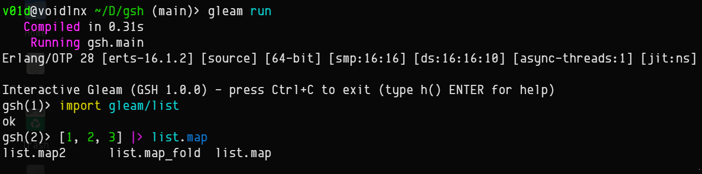
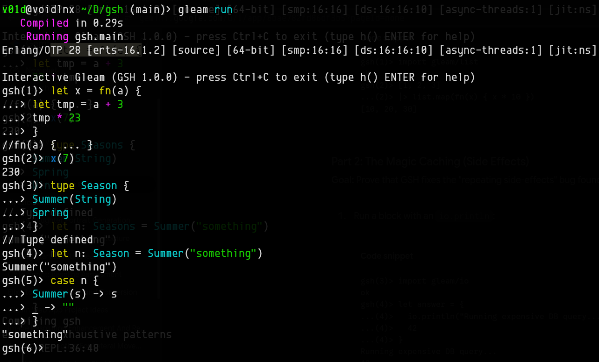
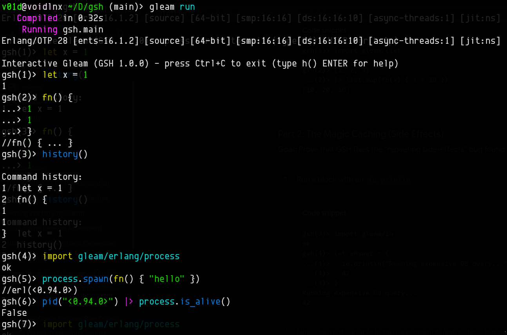

# GSH (Gleam Shell)

<!-- [](https://hex.pm/packages/gsh)
[](https://hexdocs.pm/gsh/) -->

> GSH is an interactive REPL for the [Gleam Programming Language](https://gleam.run/) written in Gleam and Erlang.

**⚠This is still a work in progress tool⚠**

## Installation
Add `gsh` to your project as a development dependency:

```bash
gleam add gsh --dev
```

## Usage
`gsh` can either be used as a standalone REPL or a live-app bootloader.

### Standalone
```bash
gleam run -m gsh
```

### App loader
```bash
gleam run -m gsh -- my_app worker_pool bg_module_1
```

## Why a REPL?
After using Elixir's `iex`, OCaml's `utop` or even Rust's `evcxr`. I really wanted to build a tool for Gleam that gets me closer to the BEAM. **GSH**, expanded as **Gleam SHell** is a materialization of that dream.

### REPL use cases
  - Function & module debugging with mock data.
  - Interaction with actors & the supervision tree.
  - Quick scratch-pad for validating logic & trivial constructs.
  - Working with the Gleam ecosystem and libraries.

## Demo
- Tab-completion with auto suggestions


- Input/Output syntax highlighting + Multi-line + Pattern matching


- Processes & built-ins (pid)



## How it works
1. `gsh` is a **"Compiler Injection REPL"**.
```plaintext
Gleam code -> Gleam compiler -> Erlang Target -> BEAM
```

2. Previously, `gsh` used to spin up and destroy a **separate BEAM node for every evaluation** (no state persistence). This introduced the **side-effect problem** where code can re-execute. `gsh` currently uses a single persistent BEAM node along with a safety layer where side-effects (like spawning a process or writing to a DB) are wrapped in type-safe **process dictionary cache**. Only the **cached memory pointer** is used in all future evaluations.

3. The **shell's state** is stored in memory for every session. It includes constructs like imports, history, assertion, bindings, functions and types.

4. [etch_erlang](https://etch-erlang.hexdocs.pm/index.html) -- a well-maintained TUI backend is used to render characters properly on the terminal.

## Feature set comparison with `iex`

| Feature | GSH (Gleam Shell) | IEx (Interactive Elixir) |
|---|---|---|
| **Live App Bootstrapping** | `gleam run -m gsh -- app` | `iex -S mix` |
| **Syntax** | Gleam (Rust-like, strict types) | Elixir (Ruby-like, dynamic) |
| **Syntax Highlighting** | Yes (ANSI-based) | Yes (Configurable ANSI) |
| **Type System** | Static (recompiles on the fly) | Dynamic |
| **Evaluation Engine** | File-backed generation + Hot code reload | Direct Erlang AST evaluation |
| **Side-Effect Safety** | Yes (Process Dictionary memoization) | Yes (Native to AST loop) |
| **VM State Persistence** | Yes (Actors, PIDs, ETS stay alive) | Yes |
| **Fault Tolerance** | Yes (Catches `Badarg` / VM crashes) | Yes |
| **Multiline Input** | Yes (Buffer completion) | Yes (Native AST parsing) |
| **Built-in Helpers** | `pid()` (easily extensible) | `h()`, `i()`, `v()`, `pid()`, etc. |
| **Autocomplete** | Keywords, bound vars, module exports | Deeply context-aware + docstrings |

## Contributing

Contributions are massively appreciated! A REPL would be a nice to have tool in the Gleam ecosystem, and there is plenty of room to grow. 